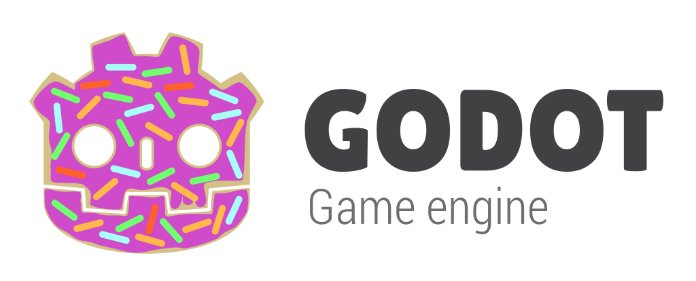

My personal fork of the godot engine with changes I need for my games.

# Godot Engine

  

## About
This is a fork of the Godot engine created to better suit my needs.
[Godot](https://github.com/godotengine/godot) is an open source engine published under the [MIT license](https://godotengine.org/license) it was originaly created by [Juan Linietsky](https://github.com/reduz) and [Ariel Manzur](https://github.com/punto-)

## Compiling from source
[See the official docs](https://docs.godotengine.org/en/latest/contributing/development/compiling)
for compilation instructions for every supported platform.

## Documentation
The official documentation is hosted on [Read the Docs](https://docs.godotengine.org).
It is maintained by the Godot community in its own [GitHub repository](https://github.com/godotengine/godot-docs).
